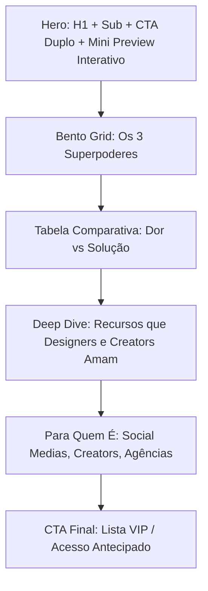

# [ISSUE] Landing Page & Transição do The Carousel Make para Produto Independente

**Status**: 🚀 Pronto para Planejamento & Execução  
**Produto**: **The Carousel Make** (`carousel-make/`)  
**Repositório Origem**: `AnalyticsOnboard`  
**Autor**: André Felipe & Antigravity Pair  

---

## 🎯 1. Contexto & Objetivo
O **The Carousel Make** evoluiu de uma ferramenta interna do Analytics para um **estúdio visual de carrosséis e criação em lote (Batch Studio)** com capacidade comercial imediata e independente.

Para viabilizar a monetização, tração e distribuição do produto:
1. **Desacoplamento Completo**: Separar o código de `carousel-make/` em um repositório próprio e independente.
2. **Construção da Landing Page**: Criar uma página de alta conversão (**OA Design / Linear-style**) destacando os diferenciais competitivos contra Canva e Figma.
3. **Preparação para Lançamento**: Configurar marca, favicons, domínio próprio e fluxo de captura de early adopters.

---

## 💎 2. Posicionamento & Proposta de Valor

### Tagline Principal
> **"Crie 30 posts para o Instagram no tempo que você levava para fazer um."**

### Subheadline
> *Um estúdio visual de canvas infinito com criação em lote, conexões de carrossel em tempo real e exportação em 4K. Cole sua planilha, ajuste o design e baixe o lote pronto em segundos.*

### Os 3 Pilares Centrais (Superpowers)
1. **🎨 Canvas Infinito Livre (Figma-feel)**: Espaço sem pranchetas isoladas, navegação panorâmica fluida e renderização ultrarrápida.
2. **⚡ Automação em Lote (Google Sheets / Excel / CSV)**: Tags dinâmicas (`{{titulo}}`, `{{corpo}}`, `{{imagem}}`) que geram dezenas de posts num único clique.
3. **🔗 Cordinhas de Conexão Contínua**: Visualização da narrativa do carrossel como um fluxo contínuo e orgânico.

---

## 📐 3. Especificação Estrutural da Landing Page

### Seção 1: Hero Section (Topo de Conversão)
* **Badge**: `✨ Novidade: Criação em Lote com Planilhas + Imagens`
* **H1**: *O estúdio visual para carrosséis e posts em escala.*
* **Subtítulo**: *Desenhe livremente no canvas infinito ou gere meses de conteúdo colando dados do Excel/Google Sheets. Sem travas, sem lentidão, 100% no seu navegador.*
* **CTAs**:
  - `[ Primário ]` **Criar meu Primeiro Post Grátis →**
  - `[ Secundário ]` Ver demonstração em 30s ▷
* **Hero Visual**: Mockup com animação do canvas infinito mostrando posts conectados por cordinhas e a tabela de lote preenchendo 10 posts em tempo real.

### Seção 2: Bento Grid (Os 3 Superpoderes)
* **Card 1 (Canvas Infinito)**: Navegação livre, zoom de 5% a 400%, sem restrições de aba.
* **Card 2 (Automação em Lote)**: De planilha para 50 posts prontos com troca dinâmica de fotos e textos.
* **Card 3 (Continuidade Narrativa)**: Cordinhas que garantem a harmonia estética e visual do carrossel.

### Seção 3: Comparativo de Mercado (The Carousel Make vs Tradicional)

| No Canva / Photoshop Tradicional 😫 | No The Carousel Make 🚀 |
| :--- | :--- |
| Duplicar post e trocar textos manualmente 30 vezes | Copiar da planilha e colar: **30 posts prontos de uma vez** |
| Baixar um por um ou esperar renderização lenta na nuvem | **Exportação instantânea em ZIP 4K** processada localmente na GPU |
| Perde a visão do fluxo narrativo do carrossel | **Canvas infinito** com visualização de toda a esteira de conteúdo |
| Planos caros com travas de fontes e recursos | **Importe suas próprias fontes (.otf, .ttf, .woff2)** e use offline |

### Seção 4: Deep Dive de Funcionalidades Técnicas
* **Arrastar e Soltar Universal**: Puxe fotos direto do Unsplash, Figma, Canva ou desktop.
* **Ajuste Fino de Foto de Fundo**: Reposicione com o mouse, zoom e filtros de legibilidade.
* **Biblioteca Integrada**: Mesh gradients, biblioteca de ícones/stickers e tipografias de alta conversão.
* **Local-first & Offline**: 100% dos dados salvos no navegador (IndexedDB) com privacidade total.

### Seção 5: Para Quem É
* **Social Medias & Agências**: Crie o calendário mensal de múltiplos clientes em uma única tarde.
* **Criadores de Conteúdo & Infoprodutores**: Transforme roteiros, tweets e aulas em carrosséis de alto impacto.
* **Designers & Growth Hackers**: Teste dezenas de variações de criativos de anúncios em segundos.

### Seção 6: CTA Final
* **Título**: *"Pare de perder horas copiando e colando texto em templates."*
* **Formulário**: Campo de e-mail com botão de acesso imediato ou lista VIP.

---

## 🛠️ 4. Roadmap de Separação & Lançamento

- [ ] **Fase 1: Validação do App Independente (`carousel-make/`)**
  - [x] Extração do código do editor sem o dashboard de analytics.
  - [x] Inicialização direta no Canvas Infinito.
  - [ ] Testes de criação em lote, reposicionamento de fotos e exportação em ZIP no `carousel-make/`.
- [ ] **Fase 2: Criação do Repositório Próprio**
  - [ ] Inicializar novo repositório `the-carousel-make` (ou nome comercial definitivo).
  - [ ] Configurar `.gitignore`, `package.json` (se aplicável) e assets de marca.
  - [ ] Definir favicon, meta tags OpenGraph e branding.
- [ ] **Fase 3: Implementação da Landing Page**
  - [ ] Criar `landing.html` (ou página inicial) com design OA / Swiss Modern.
  - [ ] Integrar preview interativo ou demo guiada.
  - [ ] Integrar formulário de captura de leads (Supabase / Resend / Mailchimp).
- [ ] **Fase 4: Deploy & Domínio**
  - [ ] Deploy na Vercel / Cloudflare Pages.
  - [ ] Apontamento de domínio próprio (`thecarouselmake.com` ou similar).
